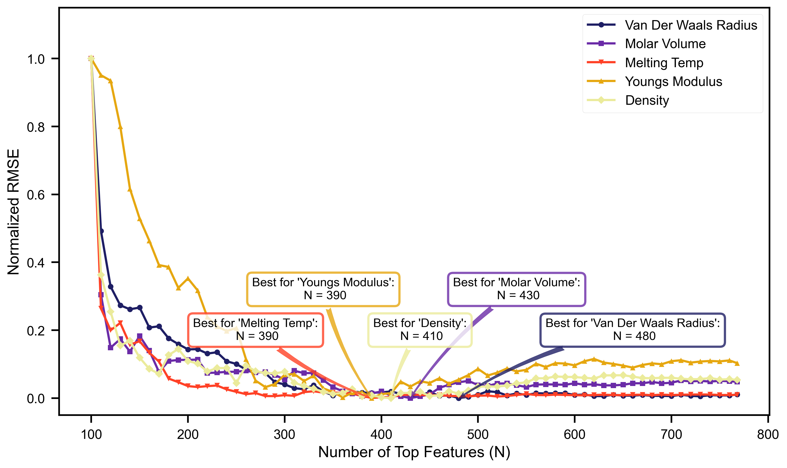
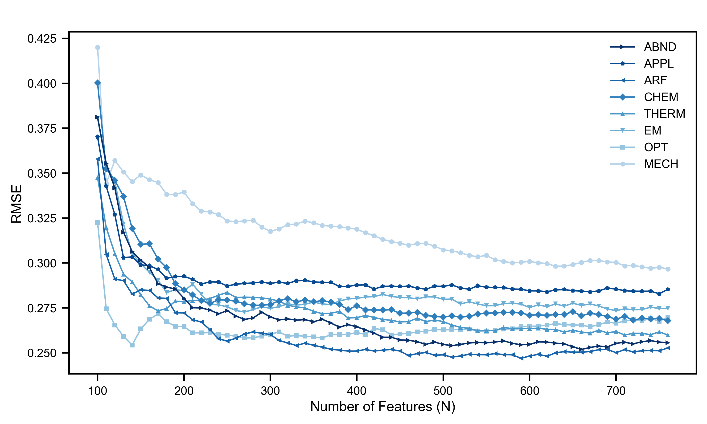

# Element Property Prediction Experiments

This repository contains the partial code for the paper ***ELEMENT2VEC: BUILD CHEMICAL ELEMENT REPRESENTATION FROM TEXT FOR PROPERTY PREDICTION***.


## Project Structure

- `main.py`: The main script to run experiment workflows.
- `embedding_sets_exp.py`: Main script for running experiments on specific, categorized **local** embedding sets.
- `global_exp.py`: Main script for running experiments on the full **global** embedding.

- `core_model.py`, `data_processing.py`, `other_func.py`: Helper modules that contain the core logic for the experiments.

- `visualization/`: A directory contains all the visualization files.
- `data/`: Two samples of our embedding sets data.
- `results/`,`outputs/`: Two directory store the experiments' results and visualization separately.


## Quick Start

This guide will get you from setup to the final figures in two steps.


### Setup Environment

First, create a `Conda` virtual environment and install the required packages from `requirements.txt`.

```python
# Create and activate the conda environment
conda create -n element_prop python=3.9
conda activate element_prop

# Install dependencies
pip install -r requirements.txt
```


### Run Workflow and Generate Figures

The `main.py` script is the single entry point for running the main workflow. It can run two main experimental pipelines, each generating one of the final figures.

```python
# To generate both figures (default behavior)
python main.py
# To generate only the 5 properties prediction on global embedding figure
python main.py global
# To generate only the 8 feature comparison on local embedding sets figure
python main.py category
```

The generated **figures** and **results** will be saved in the `outputs/` and `results/` directory


### Visualization Results





## Other Experiments

Apart from the `main.py` file, you can also run each experiment and visualization file separately.

**Before running, please review the configuration section in each file to ensure the settings match your requirements.**


#### Configuration Detail

Before running, you can check and modify the parameters in the beginning `Config` section of `embedding_sets_exp.py` and `global_exp.py` separately.

| Parameter           | Type   | Description                                                  |
| ------------------- | ------ | ------------------------------------------------------------ |
| `MODEL`             | `str`  | The model to use. Options: `'lr'`, `'mlp'`.                  |
| `SplitMethod`       | `str`  | Cross-validation method. `'ss'` for ShuffleSplit, `'kf'` for K-Fold. |
| `MISSING_RATIOS`    | `list` | A list of test set ratios to iterate over when `SplitMethod` is `'ss'`. |
| `K_Fold`            | `list` | A list of fold numbers (`k`) to iterate over when `SplitMethod` is `'kf'`. |
| `n_repeats`         | `int`  | The number of splits/repeats for ShuffleSplit.               |
| `target`            | `str`  | The name of the target property to predict.                  |
| `EMBEDDING_COLUMNS` | `list` | A list of column names that contain the local categorized feature embeddings. |
| `target_feat`       | `int`  | Set from 1 to 8 to use a single feature category. Set to `0` to use all features listed in `EMBEDDING_COLUMNS`. |
| `property_path`     | `str`  | Path to the CSV file containing target properties (`768_full.csv`). |
| `FILE_PATH`         | `str`  | Path to the CSV file containing the categorized embeddings.  |
| `OUTPUT_PATH`       | `str`  | The directory path where result files will be saved.         |
| `dataset_name`      | `str`  | A name for the dataset, used in the output filename.         |


#### **Execution Command**

Activate your virtual environment and run the following command from the project's root directory.

```python
python embedding_sets_exp.py   # the experiment on local embedding sets data
python global_exp.py           # the experiment on global embedding data
```


#### Output

Both scripts will generate `.csv` files containing the experiment results. These files will be saved in the directory specified by the `OUTPUT_PATH` variable in each script.


#### Data Visualization

The `visualization/` directory contains scripts to visualize the `.csv` results generated by experiments.

**Before running, ensure the main experiments have been completed and the result files are available.**


##### `missing_ratio.py`

This script plots the relationship between **(Best Tail Average)RMSE vs. Missing Ratio**. It's used to compare the performance of different datasets or models under various missing ratios. 

**Before running:** check and modify the `TARGET_DIRECTORIES` and `FILE_PATTERN` to specify the result you wish to process and compare.

- **Command to Run**: `python visualization/missing_ratio.py`

##### `normalized_RMSE.py`

This script plots **Normalized RMSE vs. Number of Features** to compare performance improvement trends across different properties on a common 0-1 scale.

**Before running:** You must modify the `FILES_TO_PLOT` list in the script.

- **Command:** `python visualization/normalized_RMSE.py`

##### `fig_category.py`

This script plots **RMSE vs. Number of Features** to compare the predictive performance of individual feature categories.

**Before running:** Modify the `FILES_TO_PLOT` list and `dim_limit` in the script as needed.

- **Command:** `python visualization/fig_category.py`
